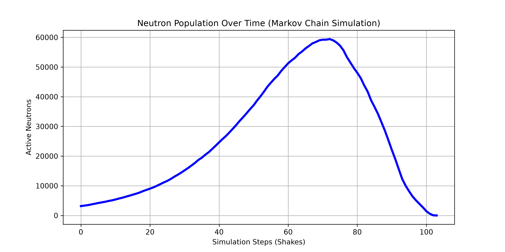
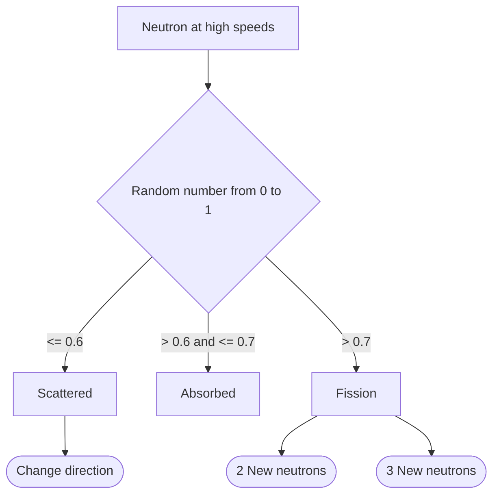

# carlopy
#### Video Demo:  [URL](https://youtu.be/qDhFyz0NxGw)
# Description:
 __The project's objective is to imitate the life cycles of neutrons in a nuclear bomb using efficient libraries such as `numpy` to vectorize each neutron's information improving efficiency and speed.__
__The desired output is a line of text in the terminal command showing the current state of the _nuclear core_ and, if desired, a graphed representation using simple `matplotlib`.__

---

__Parameters inputted into the program are the _radius_ in _cm_ of the uranium core, the _density_ in _sigma\_T_ (which describes the mean distance a neutron travels before collisioning with a neutron) and the initial _number of neutrons_ injected into the core.__

---

__Although this is a highly scientific project I refrained from using more complex maths and physics like actual densities in _cm³_ and other complex equations to keep the math simple since I am 14 years old and want to focus on the _code_.__

# Custom functions:
### List:
- `main` Provides a place to structure the program flow properly.
- `initialize_bomb` The engine that initalizes the `numpy` matrix.
- `move_particles` Function that moves the particles in 3D space.
- `enforce_boundaries` Removes any particles that exited the bomb __radius__.
- `process_collisions` Main algorithmic function that handles event probabilities.

### Explained in detail:
#### `main`
This function recollects user input, validates it, calls the functions in correct order and prints out the scientific results plus a chart if desired.
I decided to validate user input in the `main` function to make the project order more obvious but also to make sure the unit tests work (validating user input outside of any functions would create input problems).
I used a simple while loop to keep the __simulation__ running until no neutrons were left or more than 500,000 had been created.
```python
while matrix.shape[0] > 0 and matrix.shape[0] < 500000:
    matrix = move_particles(matrix, delta=DELTA_T)
    matrix = enforce_boundaries(matrix, radius=RADIUS)
    matrix, nf = process_collisions(matrix, p=P)
    NUMBER_FISSION += nf
    FRAME += 1
    if previous_size < (matrix.shape[0] * 0.95):
        status = "CRITICAL 🔴"
    elif previous_size < matrix.shape[0]:
        status = "GROWING"
    else:
        status = "SUB-CRITICAL 🔵"
    print(f"[Frame: {FRAME}] Number of active neutrons: {matrix.shape[0]:,} \"\"\"\" {status}")
    previous_size = matrix.shape[0]

    history.append(matrix.shape[0])
    #Makes the system wait a bit so it doesn't go to fast:
    time.sleep(0.05)
```
I also put inside the loop a `time` module function to make it go a little bit slower so the status warnings and other information were printed a bit slower to make the output readable for a human.

---

I also used the `sys` module to check if the user wants a chart and a simple `matplotlib` script to create a chart upon request:
```python
if len(sys.argv) > 1:
    plt.figure(figsize=(10, 5))
    plt.plot(history, color='blue', linewidth=3)
    plt.title('Neutron Population Over Time (Markov Chain Simulation)')
    plt.xlabel('Simulation Steps (Shakes)')
    plt.ylabel('Active Neutrons')
    plt.grid(True)
    plt.savefig('reactor_plot.png', dpi=300, transparent=False)
    print("\nSuccess! Simulation graph saved locally as 'reactor_plot.png'")
```
This extremely simple code (I love `matplotlib`) generates a beautifull chart like this one:


---

#### `initialize_bomb`
Arguably a very important function itself, this piece of code creates the starting matrix for all the matrix calculations after it.
```python
def initialize_bomb(num_neutrons, rng=None, radius=None, speed=None):
```
It takes as parameters the number of neutrons, an optional `rng` seed for testing, the radius and the speed of the neutrons.
The hardest piece of code to program here was this part:
```python
sixth = num_neutrons // 6
bomb[:sixth, 3] = speed
bomb[sixth:2*sixth, 3] = -speed
bomb[2*sixth:3*sixth, 4] = speed
bomb[3*sixth:4*sixth, 4] = -speed
bomb[4*sixth:5*sixth, 5] = speed
bomb[5*sixth:, 5] = -speed
```
Althoug I used a _simple_ option to assign speed to each neutron, making it flexible to the size of each array (depending on the `num_neutrons` parameter) was really hard.

---

####  `move_particles`
One of the simplest functions, it simply adds the speed divided by the timeframe to the coordinates to move the particles in 3D space:
```python
matrix[:, 0:3] += matrix[:, 3:6] * delta
return matrix
```
---

#### `enforce_boundaries`
This function is fundamental because without it the radius of the bomb would be a useless number.
```python
position_squared = np.sum(matrix[:, 0:3] ** 2, axis=1)
mask = position_squared < radius ** 2
return matrix[mask]
```
It uses simple maths squaring the sum of the coordinates to check if it is in the radius and applies a mask to the matrix filtering out any neutrons that have left the core.

---

#### `process_collisions`
By far the hardest function to implement. This piece of code handles the random paths a neutron can follow:


---

The hardest part was this one:
```python
if fission.shape[0] > 0:
    row_multipliers = rng.choice([2, 3], size=fission.shape[0])
    fission_products = np.repeat(fission, row_multipliers, axis=0)
    number_fission = fission_products.shape[0]
else:
    # Empty array if no fission happens in this step
    fission_products = np.empty((0, matrix.shape[1]), dtype=matrix.dtype)
    number_fission = 0
```
Creating either 2 or 3 new rows (randomly) per atom without creating errors. At first I tried implementing this code without the if statement but then the number of fission events returned wasn't accurate, etc.

# Classes:
At first I wanted to create a custom class that would house every neutron, but my computer couldn't handle it so I turned to matrixes.
But I still wanted to use classes so I created a custom class called `Number` that validates the user input for how many neutrons to initialize the bomb with.
But I couldn't use the same class for the radius and density because of them being `floats` not `ints` so I decided to use simpler validation for them.

# Extra files:
I also created extra files such as:
1. `requirements.txt`
2. `expected_matrix.npy` Used to store the matrix I expect to be initialized in my unit tests.
3. `extras.py` Used to create information for the unit tests.
4. `permanent.png` File where the graph shown above lives.

Thank you to CS50p, that was my project.

